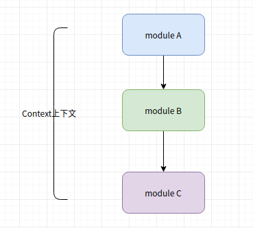
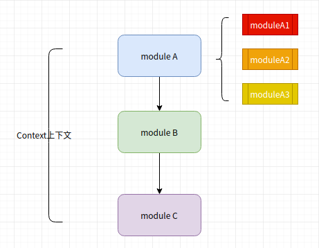

 # 模块拆分


## 背景

`B2B`的业务往往十分复杂，这在代码上可能表现为大量的，嵌套的if else， 嵌套的方法， 以及其他混乱的现象。

随着服务的商家数量增多，特殊逻辑也随之增多，慢慢变得难以维护，特殊逻辑散落在系统各处，没人能够讲得清系统。


## Demo 场景

以从HTTP或者其他通道创建订单为例子，展示如何使用进行简单的模块化拆分

在创建一个订单的过程中，我们可能需要做很多事情，为了易于理解，先做极大地简化，

eg：

- 基本参数校验    
- 权限校验
- 商品校验
- 商品明细合并
- 库存操作
- 落库

实际中一个接单流程可能有15-30个具体的事务，每个事务除了通用逻辑外，可能还有特殊逻辑。

在此Demo中，我们只抽象出模块A，B，C。便于理解。

在创建一个订单的过程中，我们需要经过业务模块A，B, C 3个模块的处理


## 简单实现




目录结构如下

```

├── pom.xml
└── src
    ├── main
    │   ├── java
    │   │   └── com
    │   │       └── example
    │   │           └── splitmodule   
    │   │               └── simple  源码包
    │   │                   ├── anno  模块注解
    │   │                   │   └── Module.java
    │   │                   ├── constant  模块枚举
    │   │                   │   └── ModuleEnum.java
    │   │                   ├── context    上下文
    │   │                   │   ├── ModuleContext.java
    │   │                   │   ├── OrderDetail.java
    │   │                   │   └── Order.java
    │   │                   ├── exception   异常构造
    │   │                   │   ├── AbstractException.java
    │   │                   │   ├── ErrorCodeEnum.java
    │   │                   │   ├── ExceptionBuilder.java
    │   │                   │   └── XXException.java
    │   │                   ├── service   
    │   │                   │   ├── holder   持有所有模块
    │   │                   │   │   └── ModuleServiceHolder.java
    │   │                   │   ├── impl   各模块
    │   │                   │   │   ├── ModuleA.java
    │   │                   │   │   ├── ModuleB.java
    │   │                   │   │   └── ModuleC.java
    │   │                   │   ├── ModuleExecutor.java  //模块执行器
    │   │                   │   └── ModuleService.java   // 模块服务抽象
    │   │                   ├── SimpleSplitModuleApplication.java
    │   │                   └── utils
    │   │                       └── AopTargetUtils.java
    │   └── resources    //配置文件
    │       ├── application.properties
    │       └── spring
    │           └── spring-main.xml
    └── test       //测试代码
    

```


挑几个来看一下。

由于需要执行几个模块，信息需要共享，所以使用上下文

```java
@Data
@Slf4j
public class ModuleContext implements Serializable {

    private static final long serialVersionUID = 2300055553282466135L;

    private String no;

    private Order order;

    // 附加属性
    private Map<String, Object> attachmentMap = new HashMap<String, Object>();

    protected static final String KEY_TID = "KEY_TID";
    public static final String KEY_LOG_PRE = "KEY_LOG_PRE";


    public void putTid(Long tid) {
        this.attachmentMap.put(KEY_TID, tid);
    }

    public Long getTid() {
        return (Long) this.attachmentMap.get(KEY_TID);
    }

    public void putLogPre(String pre) {
        this.attachmentMap.put(KEY_LOG_PRE, pre);
    }

    public String getLogPre() {
        return (String) this.attachmentMap.get(KEY_LOG_PRE);
    }

    public static ModuleContext build(){
        return  new ModuleContext();
    }

    public ModuleContext buildWithOrder(Order order) {
        this.order = order;
        return this;
    }

    public ModuleContext buildWithTid(Long tid) {
        this.attachmentMap.put(KEY_TID, tid);
        return this;
    }

    public ModuleContext buildWithLogPre(String pre) {
        this.attachmentMap.put(KEY_LOG_PRE, pre);
        return this;
    }

}
```

订单实体类

```java
/**
 * 不能更简单的订单
 */
@Data
public class Order {
    // 外部订单来源
    private String externalSource;
    // 外部订单号
    private String externalOrderNo;
    // 订单标志
    private String orderMark;
    // 订单类型
    private String orderType;
    // 订单状态
    private Integer orderStatus;
    // 店铺编号
    private String shopNo;
    .......
     // 订单商品明细
    List<OrderDetail> orderDetailList;
}
        
```


模块注解

```java
@Target(ElementType.TYPE)
@Retention(RetentionPolicy.RUNTIME)
@Documented
public @interface Module {

    /**
     * 所属模块, 参考：{@link ModuleEnum}
     *
     * @return
     */
    ModuleEnum value();
}

```

模块枚举

```java
public enum ModuleEnum {

    A("A", "模块A的作用"),
    B("A", "模块B的作用"),
    C("A", "模块C的作用"),
    ;

    private String key;

    private String desc;

    public String getKey() {
        return key;
    }

    public String getDesc() {
        return desc;
    }

    ModuleEnum(String key, String desc) {
        this.key = key;
        this.desc = desc;
    }
}

```


模块初始化持有

```java
@Slf4j
@Lazy(false)
@Component
public class ModuleServiceHolder implements InitializingBean, ApplicationContextAware {
    private ApplicationContext applicationContext;
    // 模块map
    private static final Map<ModuleEnum, ModuleService> cachedMap = new ConcurrentHashMap<>();

    public static ModuleService getModuleServiceCached(ModuleEnum module) {
        return cachedMap.get(module);
    }

    @Override
    public void afterPropertiesSet() throws Exception {
        log.info("【模块服务持有器】开始初始化");
        // 按照验证的业务粒度分类
        Map<String, ModuleService> moduleMap = this.applicationContext.getBeansOfType(ModuleService.class,false,true);
        log.info("【模块服务持有器】扫描到MapperService的实现：" + moduleMap.keySet());
        ModuleEnum key;

        for (ModuleService service : moduleMap.values()) {
            // 考虑被代理的情况
            ModuleService target = (ModuleService) AopTargetUtils.getTarget(service);
            if (null == target) {
                return;
            }
            key = target.getClass().getAnnotation(Module.class).value();
            log.info("【模块服务持有器】[" + key.getDesc() + "]：" + service.getClass().getName());
            if (!cachedMap.containsKey(key)) {
                cachedMap.put(key, service);
            }
        }
    }
    @Override
    public void setApplicationContext(ApplicationContext applicationContext) throws BeansException {
        this.applicationContext = applicationContext;
    }
}
```


执行器

```java
/**
 * 模块执行器
 */
@Slf4j
public class ModuleExecutor {
    /**
     * @param module  {@link ModuleEnum}
     * @param context 上下文对象
     */
    public static void execute(ModuleContext context, ModuleEnum module) {

        try {
            ModuleService service = ModuleServiceHolder.getModuleServiceCached(module);

            if (null == service) {
                log.error("{}【模块映射】没有匹配到对应的映射服务:{}", context.getLogPre(), module.getDesc());
                throw ExceptionBuilder.buildException(ErrorCodeEnum.SYSTEM_ERROR, "【模块映射】没有匹配到对应的映射服务：" + module.getDesc() + ",请检查配置");
            }

            long beginTime = System.nanoTime();

            log.info("{}【模块映射】模块:{}, 执行服务:{}", context.getLogPre(), module.getDesc(), service.getClass().getName());

            service.execute(context);

            log.info(context.getLogPre() + "【模块映射】模块：" + module.getDesc() + "， " + "验证耗时(ms)：" + (System.nanoTime() - beginTime) / 1e6);


        } catch (Exception ex) {
            log.error(context.getLogPre() + "【模块映射】模块：" + module.getDesc() + ", 发生未知异常：" + ex.getMessage(), ex);
        } finally {

        }
    }
}
```


结果

```
[ main] .e.s.s.SimpleSplitModuleApplicationTests : Starting SimpleSplitModuleApplicationTests on HomeMint with PID 31512 
[ main] c.e.s.s.s.holder.ModuleServiceHolder     : 【模块服务持有器】开始初始化
[ main] c.e.s.s.s.holder.ModuleServiceHolder     : 【模块服务持有器】扫描到MapperService的实现：[moduleA, moduleB, moduleC]
[ main] c.e.s.s.s.holder.ModuleServiceHolder     : 【模块服务持有器】[模块A的作用]：com.example.splitmodule.simple.service.impl.ModuleA
[ main] c.e.s.s.s.holder.ModuleServiceHolder     : 【模块服务持有器】[模块B的作用]：com.example.splitmodule.simple.service.impl.ModuleB
[ main] c.e.s.s.s.holder.ModuleServiceHolder     : 【模块服务持有器】[模块C的作用]：com.example.splitmodule.simple.service.impl.ModuleC
[ main] .e.s.s.SimpleSplitModuleApplicationTests : Started SimpleSplitModuleApplicationTests in 0.649 seconds (JVM running for 1.448)
[ main] c.e.s.simple.service.ModuleExecutor      : [测试订单,no=order1]【模块映射】模块:模块A的作用, 执行服务:com.example.splitmodule.simple.service.impl.ModuleA
[ main] c.e.s.simple.service.impl.ModuleA        : 执行模块A
[ main] c.e.s.simple.service.ModuleExecutor      : [测试订单,no=order1]【模块映射】模块：模块A的作用， 验证耗时(ms)：0.971604
[ main] c.e.s.simple.service.ModuleExecutor      : [测试订单,no=order1]【模块映射】模块:模块B的作用, 执行服务:com.example.splitmodule.simple.service.impl.ModuleB
[ main] c.e.s.simple.service.impl.ModuleB        : 执行模块B
[ main] c.e.s.simple.service.ModuleExecutor      : [测试订单,no=order1]【模块映射】模块：模块B的作用， 验证耗时(ms)：0.091958
[ main] c.e.s.simple.service.ModuleExecutor      : [测试订单,no=order1]【模块映射】模块:模块C的作用, 执行服务:com.example.splitmodule.simple.service.impl.ModuleC
[ main] c.e.s.simple.service.impl.ModuleC        : 执行模块C
[ main] c.e.s.simple.service.ModuleExecutor      : [测试订单,no=order1]【模块映射】模块：模块C的作用， 验证耗时(ms)：0.142479

```


## 进阶实现

### 思路

在简单实现中，每个Module只有一个实现，这在实际中是不太可能的，往往一些商家会有特殊逻辑，所以我们其实需要一个默认实现和多个特殊实现。以ModuleA为例子。



那么如何选择moduleA的多个实现呢

这需要路由，比如我们定义如下2级别路由，这个二级路由是由Key1，Key2组成。默认Key1是比Key2更大的集合。

但是可以直接指定Key2。

这就像是国家和地区的概念，我可以直接指定北京，那我一定在中国，但是北京这个地方有特殊实现，如果我们没指定北京，那就看看中国地区有没有特殊实现，中国也没有，那就用世界级的默认实现。

优先级如下：

- moduleA特殊实现 key1=null key2=k2    key=null-k2
- moduleA特殊实现 key1=k1    key2=*      key=k1-*

- moduleA默认实现  key1=null key2=null  key=null-null


### 实现

我们可以增加@Module注解的含义

```java
@Target(ElementType.TYPE)
@Retention(RetentionPolicy.RUNTIME)
@Documented
public @interface Module {

    /**
     * 所属模块, 参考：{@link ModuleEnum}
     *
     * @return
     */
    ModuleEnum value();
    
    String key1() default "";
    
     String key2() default "";
}
```

然后在持有器holder中,更改holder的缓存map

```java
    // 模块map更改前
    private static final Map<ModuleEnum, ModuleService> cachedMap = new ConcurrentHashMap<>();

    // 模块map更改后
    private static final Map<ModuleEnum, Map<String,ModuleService> cachedMap = new ConcurrentHashMap<>();
```

然后根据具体的ModuleEnum类型，以及路由key，调用合适的模块实现，都是ModuleService的实现类。


## 效果

在业务代码比较少的时候完全看不出效果，但是当你某阶段根据业务划分的模块数量增大到几十个，且每个模块均有商家需要特殊实现的时候，这种拆分的模块的方式就可以更容易的维护、修改代码。

优点：

- 按业务领域的知识划分模块，易于理解，比如我在校验模块中只需要关心校验的事情
- 修改某个模块只影响自己
- 需要新增业务逻辑只需在合适的阶段，插入新模块，对扩展开发，对修改关闭。


## Todo List

- [x] 注解定义模块
- [x] 横切逻辑计算模块耗时
- [x] 统一自定义异常
- [ ] 允许一个模块多种实现，增加路由选择
- [ ] 补充测试用例